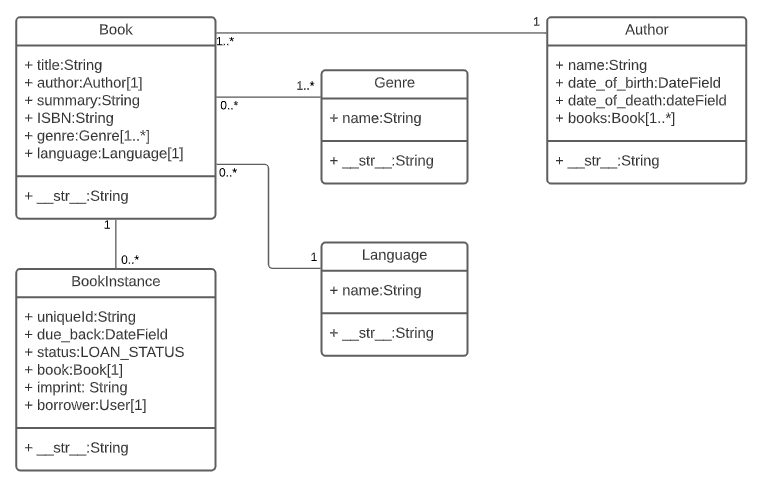

## Django Tutorial Part 3: Using models:

Django web applications access and manage data through Python objects referred to as models. Models define the structure of stored data, including the field types and possibly also their maximum size, default values, selection list options, help text for documentation, label text for forms, etc. The definition of the model is independent of the underlying database — you can choose one of several as part of your project settings. Once you've chosen what database you want to use, you don't need to talk to it directly at all — you just write your model structure and other code, and Django handles all the dirty work of communicating with the database for you.

## Designing the LocalLibrary models:

When designing your models it makes sense to have separate models for every "object" (a group of related information). In this case, the obvious objects are books, book instances, and authors.

You might also want to use models to represent selection-list options (e.g. like a drop down list of choices), rather than hard coding the choices into the website itself — this is recommended when all the options aren't known up front or may change. Obvious candidates for models, in this case, include the book genre (e.g. Science Fiction, French Poetry, etc.) and language (English, French, Japanese).

Once we've decided on our models and field, we need to think about the relationships. Django allows you to define relationships that are one to one (OneToOneField), one to many (ForeignKey) and many to many (ManyToManyField).

With that in mind, the UML association diagram below shows the models we'll define in this case (as boxes).

We've created models for the book (the generic details of the book), book instance (status of specific physical copies of the book available in the system), and author. We have also decided to have a model for the genre so that values can be created/selected through the admin interface. We've decided not to have a model for the BookInstance:

status — we've hardcoded the values (LOAN_STATUS) because we don't expect these to change. Within each of the boxes, you can see the model name, the field names, and types, and also the methods and their return types.

The diagram also shows the relationships between the models, including their multiplicities. The multiplicities are the numbers on the diagram showing the numbers (maximum and minimum) of each model that may be present in the relationship. For example, the connecting line between the boxes shows that Book and a Genre are related. The numbers close to the Genre model show that a book must have one or more Genres (as many as you like), while the numbers on the other end of the line next to the Book model show that a Genre can have zero or many associated books.

## Model primer:

## Model definition:

Models are usually defined in an application's models.py file. They are implemented as subclasses of django.db.models.Model, and can include fields, methods and metadata. The code fragment below shows a "typical" model, named MyModelName:

### Fields:

A model can have an arbitrary number of fields, of any type — each one represents a column of data that we want to store in one of our database tables. 

Each database record (row) will consist of one of each field value. Let's look at the example seen below:

my_field_name = models.CharField(max_length=20, help_text='Enter field documentation')

Common field types:

CharField is used to define short-to-mid sized fixed-length strings. You must specify the max_length of the data to be stored.

TextField is used for large arbitrary-length strings. You may specify a max_length for the field, but this is used only when the field is displayed in forms (it is not enforced at the database level).

IntegerField is a field for storing integer (whole number) values, and for validating entered values as integers in forms.

DateField and DateTimeField are used for storing/representing dates and date/time information (as Python datetime.

date in and datetime.datetime objects, respectively). 

EmailField is used to store and validate email addresses.

FileField and ImageField are used to upload files and images respectively (the ImageField adds additional validation that the uploaded file is an image).

AutoField is a special type of IntegerField that automatically increments. 

A primary key of this type is automatically added to your model if you don’t explicitly specify one.

ForeignKey is used to specify a one-to-many relationship to another database model (e.g. a car has one manufacturer, but a manufacturer can make many cars).

ManyToManyField is used to specify a many-to-many relationship (e.g. a book can have several genres, and each genre can contain several books).

### Metadata :

You can declare model-level metadata for your Model by declaring class Meta, as shown.

class Meta:
    ordering = ['-my_field_name']

## Methods :
  
A model can also have methods.

Minimally, in every model you should define the standard Python class method __str__() to return a human-readable string for each object. This string is used to represent individual records in the administration site (and anywhere else you need to refer to a model instance). Often this will return a title or name field from the model.

def __str__(self):
    return self.field_name

### Model management:

Once you've defined your model classes you can use them to create, update, or delete records, and to run queries to get all records or particular subsets of records. We'll show you how to do that in the tutorial when we define our views, but here is a brief summary.

Creating and modifying records
To create a record you can define an instance of the model and then call save().

-----------------------------------------------------------------------------------------------

## Django Tutorial Part 4: Django admin site:

Registering models 
First, open admin.py in the catalog application (/locallibrary/catalog/admin.py). It currently looks like this — note that it already imports django.contrib.admin:

from django.contrib import admin

## Register your models here.

Copy to Clipboard
Register the models by copying the following text into the bottom of the file. This code imports the models and then calls admin.site.register to register each of them.

from .models import Author, Genre, Book, BookInstance

admin.site.register(Book)
admin.site.register(Author)
admin.site.register(Genre)
admin.site.register(BookInstance)

## Creating a superuser:

python3 manage.py createsuperuser

## Logging in and using the site:

To login to the site, open the /admin URL (e.g. http://127.0.0.1:8000/admin) and enter your new superuser userid and password credentials (you'll be redirected to the login page, and then back to the /admin URL after you've entered your details).

Click on the Add link to the right of Books to create a new book (this will display a dialog much like the one below). Note how the titles of each field, the type of widget used, and the help_text (if any) match the values you specified in the model. 

Enter values for the fields. You can create new authors or genres by pressing the + button next to the respective fields (or select existing values from the lists if you've already created them). When you're done you can press SAVE, Save and add another, or Save and continue editing to save the record.

When you've finished adding books, click on the Home link in the top bookmark to be taken back to the main admin page. Then click on the Books link to display the current list of books (or on one of the other links to see other model lists).

 Now that you've added a few books, the list might look similar to the screenshot below. The title of each book is displayed; this is the value returned in the Book model's __str__() method that we specified in the last article.

You can edit a book by selecting its name in the link. The edit page for a book, shown below, is almost identical to the "Add" page. The main differences are the page title (Change book) and the addition of Delete, HISTORY and VIEW ON SITE buttons (this last button appears because we defined the get_absolute_url() method in our model).

